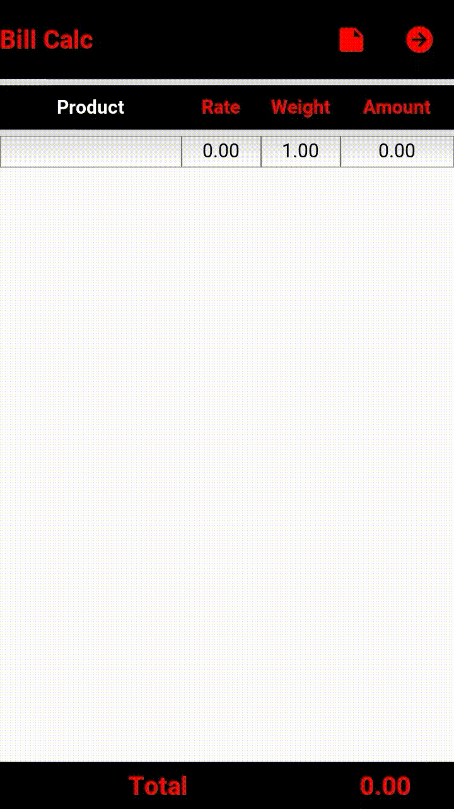

# bill-calculator

Instructions:

   * Validate-text:
        Refer the keywords in keyword screen and type the any keywords in the cell.Then click enter.
   * Add new row:
        Double tap any cell(product,rate,weight).
<h3>Demo</h3>

